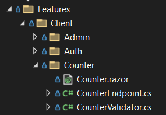
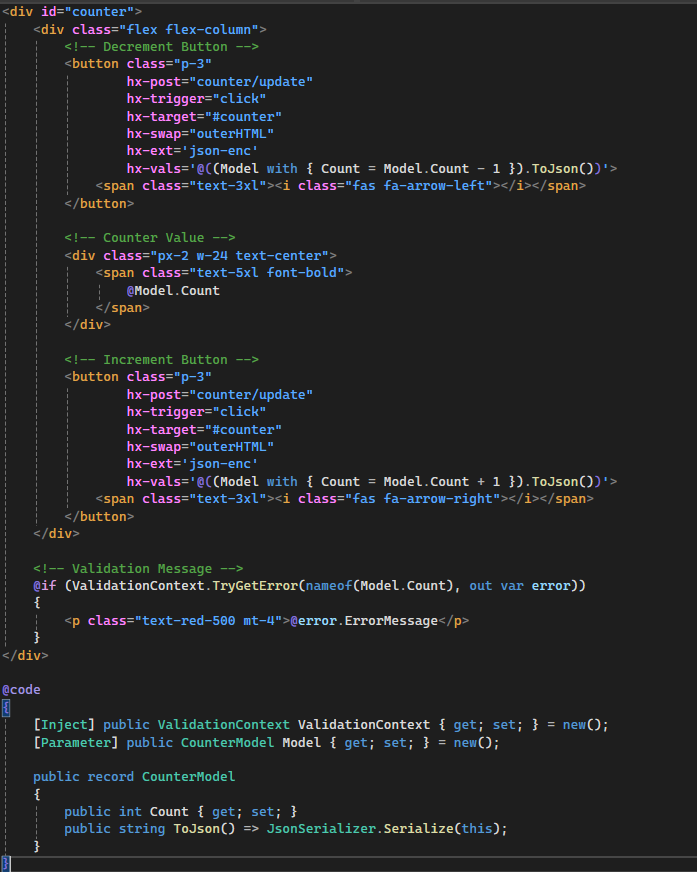
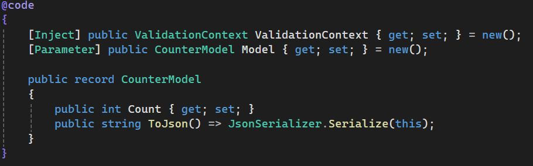
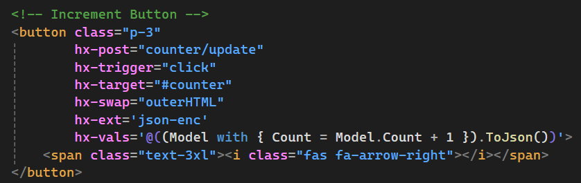
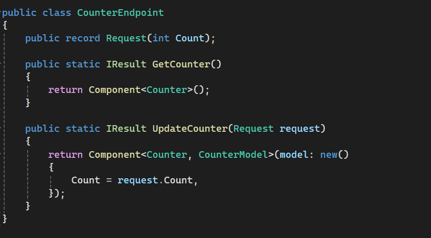
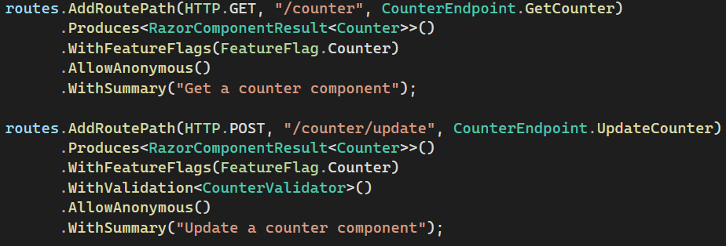
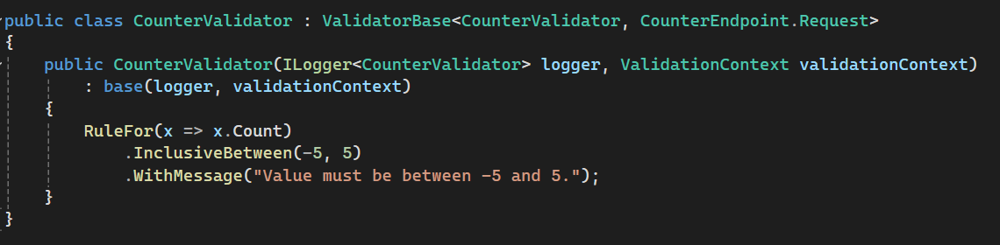
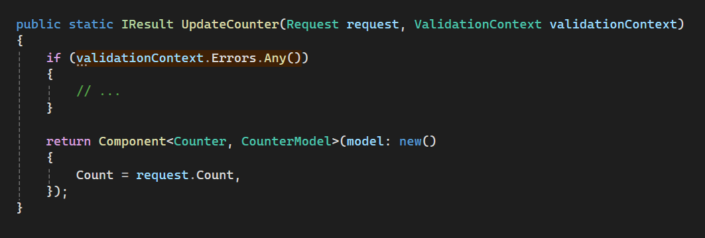
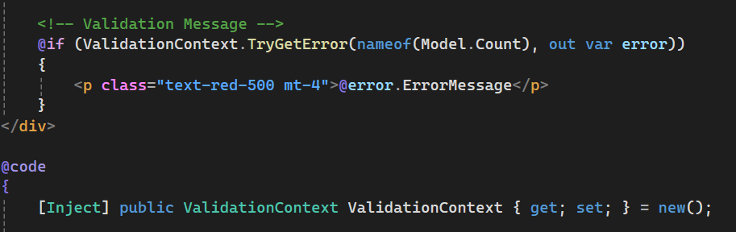

# MARCH
```Minimal APIs, Razor Components & HTMX```

### A no-nonsense approach to creating Server-Side-Rendered web applications

MARCH is a project template for creating interactive Server-Side Rendered web applications. 
The project architecture is based on the concept of HATEOAS (hypermedia as the engine of application state) 
and MARCH implements this with .NET Minimal APIs, Razor Components and HTMX.

Minimal API's offer a slim and compact framework for creating HTTP services. 
With Minimal APIs, you can quickly spin up endpoints, handle requests, and return responses 
without the need for complex boilerplate code. With ASP.NET Core Web Api as the backend framework, 
you can take full advantage of the robust .NET ecosystem, with essential backend services like 
dependency injection, middleware, authentication/authorization, ORMs etc.

Razor Components act as the HTML templating engine. They bring the power of component-based development 
to .NET and enables building reusable, encapsulated UI components. By mixing C# and HTML together, 
Razor Components integrate perfectly with the .NET backend code.

HTMX brings interactivity to the server-side rendered content without the need for heavy client-side frameworks. 
HTMX extends standard HTML with custom attributes, enabling actions like HTTP requests, form submissions, 
and partial page updates. By augmenting your Razor Components with HTMX attributes and communicating 
with ASP.NET Core Minimal APIs, HTMX keeps the front end interactive without full page reloads, 
making it an ideal choice for lightweight and responsive web applications.

For CSS styling, you can simply bring in your own favorite CSS framework, whether it's Tailwind CSS, Bootstrap or your custom CSS library.

Check out the live demo site at [https://march-project.azurewebsites.net](https://march-project.azurewebsites.net)

>Wait a minute, isn't this Blazor ? 🤔 \
Nope. Even though technologies like .NET, C# and Razor Components are utilized in this project,
Blazor does not play a role here at all. In fact, even though Blazor could be integrated into
a MARCH project, we deliberately avoid having Blazor as a dependency here in order to demonstrate
the capibilities.

## How it works

MARCH leans heavily on vertical slice architecture and the concept of features. 
Let's have a look at how the classic Counter component is implemented 
in a MARCH project and see how Minimal APIs, Razor Components and HTMX come together.

### 1. 
Under Features > Client > Counter folder you can find all the code that belongs to the Counter feature.



### 2. 
Counter.razor is a Razor component and contains the HTML template for the counter.
Razor is a markup syntax for embedding .NET based code into webpages and it enables
you to mix HTML and C# together, to make a dynamic reusable UI component.
Pretty much everything you can do in C#, you can do inside the markup:
loops, if statements, LINQ, you name it.



### 3. 
At the bottom of Counter.razor you can find the @code { } block where you can use
component life-cycle hooks, declare component parameters and even inject services
from the dependency injection container built into ASP.NET Core.



### 4. 
The HTML contains buttons for incrementing and decrementing the counter.
Pay close attention to the HTMX attributes that are attached to the buttons
and how the C# model is utilized inside the HTML.



When this button is clicked, HTMX executes a HTTP POST request to counter/update endpoint. 
The POST request's body is specified in the hx-vals attribute: a JSON serialized 
representation of our model, where the count is +1 to whatever was in the model 
at the time of rendering this component.

Because the hx-target attribute defines the target to be the Counter component's 
outermost div (with id of counter), clicking this button means that the counter 
basically replaces itself with a new counter component returned from the server, 
but with the count incremented by one compared to what was previously on the screen.

### 5. 
We now have the UI element, next we need to somehow handle those HTTP requests
that are being made via HTMX to the /counter endpoints.

Here's the contents of CounterEndpoint.cs


### 6.
Ok, cool. We have a UI component and endpoint handlers that return that component in 
different states. But where are the routes? How are these glued together?

The "glue" is in program.cs. In there, you register what routes you want, 
the endpoint handlers for those routes, whether the route requires authorization or not, etc.

Here's how the GetCounter and UpdateCounter features are registered in Program.cs


### Bonus: Validators and Feature Flags
If you looked closely at the previous image of Program.cs, you might have seen that there 
were some additional functions chained into the feature registration, mainly these:

```csharp
.WithFeatureFlags(FeatureFlag.Counter)
.WithValidation<CounterValidator>()
```

### Feature Flags
Feature flags are simply enum values. Their enabled/disabled state can be set in appsettings.json, 
where there needs to be a property with the same name as the enum value. 
By changing these values, features can be enabled or disabled at runtime.

```json
"Features": {
    "Counter": {
        "Enabled": true,
        //...
    },
    // ...
}
```

When we add WithFeatureFlags(FeatureFlag.Counter) on the counter feature, 
the enabled/disabled state of that feature is evaluated at the beginning of each request. 
If the feature is disabled, the request pipeline is short circuited and the endpoint handlers are not called.

### Validators
Validators are classes that, through the ValidatorBase base class, implement the IValidator interface 
from Fluent Validation library. They contain validation logic that is executed against the incoming request model.

For example, here's what the validator for the Counter looks like. It validates the Request type 
we defined inside CounterEndpoint.cs and it only considers count between -5 and 5 to be valid.



You can test this yourself at the [Counter demo page](https://march-project.azurewebsites.net/counter).

After you have defined a validator, and added it to a feature by calling WithValidation<CounterValidator>(), 
the validator is executed at the beginning of each request, before the request arrives at the endpoint handler.

Unlike Feature Flags, a failed validation does not short circuit the request. 
We want to continue processing the request, executing the endpoint handler 
and probably even return the Counter component to the client even if there were validation errors. 
The returned component can display validation error messages, for example.

But how do you get access to the validation results if the validation was executed 
before the request even arrived at the endpoint handler?

The answer is the ValidationContext service. It is a service with a scoped lifetime, 
and you can simply inject it wherever you need access to the validation results of the current request.

In an endpoint handler:



...or inside a Razor component:


